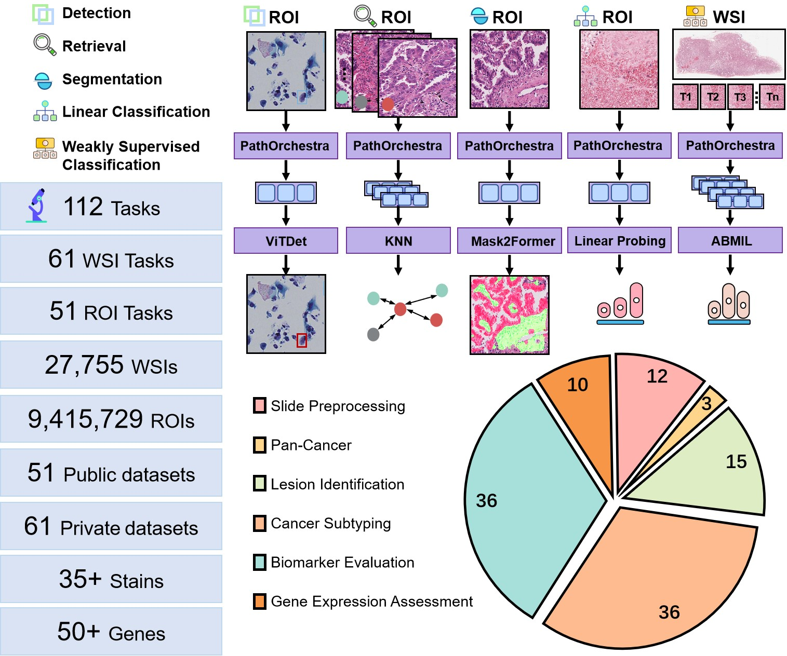

## Using PathOrchestra with PIANO
You can use [PIANO (Pathology Image ANalysis Orchestrator)](https://github.com/WonderLandxD/PIANO/tree/preview), a user-friendly PyTorch library, to load and use PathOrchestra along with comprehensive tools for pathology image processing and analysis.

    

